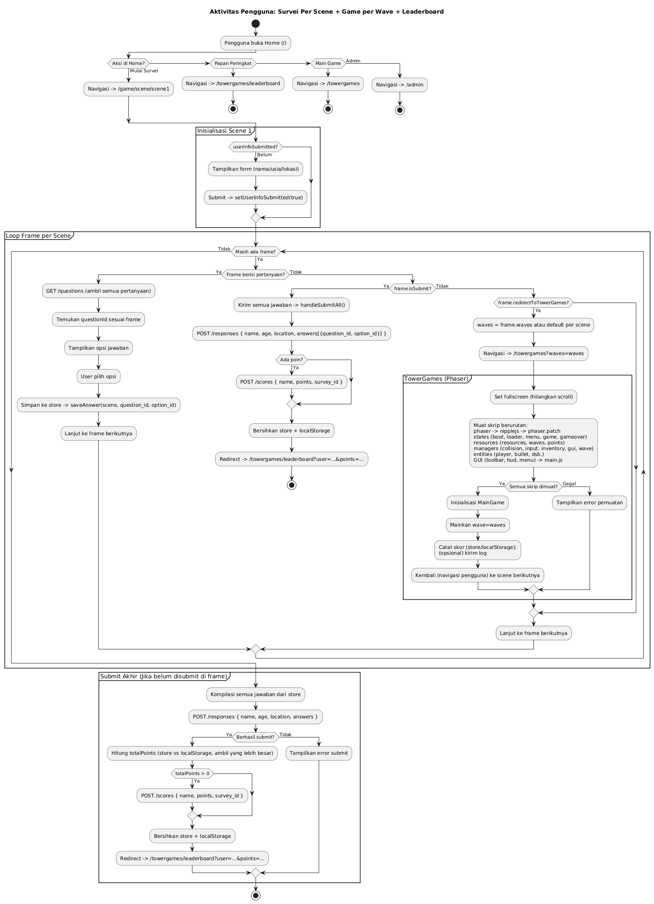

# Questionnaire Frontend

A modern Next.js frontend application for the AI usage questionnaire survey system.

## Features

- **User-friendly Survey Interface**: Clean and responsive questionnaire form
- **Admin Dashboard**: Complete CRUD operations for questions and responses
- **Data Visualization**: Charts and statistics for survey results
- **Export Functionality**: Download responses as CSV
- **Modern UI**: Built with Tailwind CSS and Lucide React icons
- **Type Safety**: Full TypeScript support

## Tech Stack

- **Framework**: Next.js 15 with App Router
- **Language**: TypeScript
- **Styling**: Tailwind CSS
- **Icons**: Lucide React
- **Charts**: Recharts
- **Forms**: React Hook Form with Zod validation
- **HTTP Client**: Axios

## Getting Started

### Prerequisites

- Node.js 18+ 
- npm or yarn
- Backend API running (Laravel)

### Installation

1. Install dependencies:
```bash
npm install
```

2. Create environment file:
```bash
cp .env.example .env.local
```

3. Configure the API URL in `.env.local`:
```env
NEXT_PUBLIC_API_URL=http://localhost:8000/api
```

4. Run the development server:
```bash
npm run dev
```

5. Open [http://localhost:3000](http://localhost:3000) in your browser.

## Project Structure

```
src/
├── app/                    # Next.js App Router pages
│   ├── admin/             # Admin pages
│   │   ├── page.tsx       # Admin dashboard
│   │   ├── questions/     # Question management
│   │   ├── responses/     # Response viewing
│   │   └── export/        # Data export
│   ├── questionnaire/     # Survey form
│   └── page.tsx           # Home page
├── components/            # Reusable components
├── lib/                   # Utility functions
│   └── api.ts            # API service functions
└── types/                # TypeScript type definitions
    └── index.ts          # Main type definitions
```

## Pages

### Public Pages

- **Home** (`/`): Landing page with navigation to survey and admin
- **Questionnaire** (`/questionnaire`): Survey form for users to fill out

### Admin Pages

- **Dashboard** (`/admin`): Overview with statistics and charts
- **Questions** (`/admin/questions`): CRUD operations for survey questions
- **Responses** (`/admin/responses`): View all survey responses
- **Export** (`/admin/export`): Download responses as CSV

## API Integration

The frontend communicates with the Laravel backend through the API service in `src/lib/api.ts`. All API calls are typed and include error handling.

### Key API Functions

- `getQuestions()`: Fetch active questions for the survey
- `submitResponse()`: Submit a new survey response
- `getAdminQuestions()`: Fetch all questions (admin)
- `createQuestion()`, `updateQuestion()`, `deleteQuestion()`: Question CRUD
- `getResponses()`: Fetch all responses (admin)
- `getStatistics()`: Get survey statistics
- `exportResponses()`: Export data as CSV

## Styling

The application uses Tailwind CSS for styling with a consistent design system:

- **Colors**: Blue primary, green success, red danger, purple secondary
- **Components**: Cards, buttons, forms, tables, modals
- **Responsive**: Mobile-first design approach
- **Icons**: Lucide React icons throughout the interface

## Development

### Available Scripts

- `npm run dev`: Start development server
- `npm run build`: Build for production
- `npm run start`: Start production server
- `npm run lint`: Run ESLint

### Code Quality

- TypeScript for type safety
- ESLint for code linting
- Prettier for code formatting
- React Hook Form for form management
- Zod for schema validation

## Deployment

The application can be deployed to various platforms:

### Vercel (Recommended)
```bash
npm run build
vercel --prod
```

### Other Platforms
Build the application and deploy the `out` directory:
```bash
npm run build
npm run export
```

## Environment Variables

Create a `.env.local` file with the following variables:

```env
NEXT_PUBLIC_API_URL=http://localhost:8000/api
```

## UML Diagrams

### Admin Flow


### User Flow


## Contributing

1. Fork the repository
2. Create a feature branch
3. Make your changes
4. Add tests if applicable
5. Submit a pull request

## License

This project is licensed under the MIT License.
